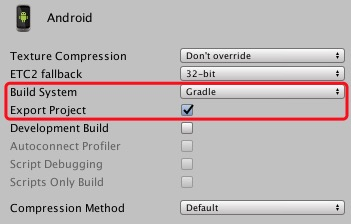
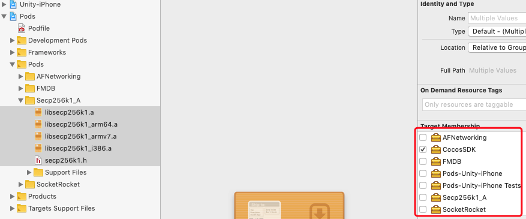

# BCX-Unity-SDK


## Introduction

The BCX-Unity-SDK is based on [BCX-Android-SDK](https://github.com/Cocos-BCX/AndroidSdk) and [BCX-iOS-SDK](https://github.com/Cocos-BCX/iOSSDK) , which provide a series of interfaces for Unity to operate the BCX blockchain, allowing users to handle logins, transfers, trading assets, calling contracts, and more.

## Project Description

### Directory Introduction

* `android` a wrapper library of BCX-Android-SDK, so can easily call from Unity
* `ios` a wrapper library of BCX-iOS-SDK, so can easily call from Unity
* `unity` BCX-Unity-SDK Project, BCX-Unity-SDK is export from this project

### Script Introduction

`tool/genLibAndSync.sh` Generate Android/iOS library and sync them to the BCX-Unity-SDK project.

## BCX-Unity-SDK

## Environment

### Android

1. [Android Studio](https://developer.android.com/studio)

### iOS

1. [CocoaPods](https://cocoapods.org/)
2. Xcode

### Unity

1. [Untiy 2018.1+](https://unity.com/)
2. git

## Android/iOS Library

Run the following command to automatically generate the library file of the corresponding platform.

```bash
./tool/genLibAndSync.sh
```

## Test

### Android

1. clone bcx-unity by run:

```bash
git clone https://github.com/Cocos-BCX/UnitySDK.git
```

2. update submodule

```bash
git submodule update --init
```

3. generate library

```bash
tool/genLibAndSync.sh
```

4. Export Android project in Unity, with follow settings:



5. Open the exported project with Android Studio
6. Compile, Run

PS. When compiling on Android, you may got a similar error in `Error: Cannot fit requested classes in a single dex file (# methods: 149346 > 65536). This is because Android has a limit on the number of methods in a single jar.

you can fix it with the solution below:

build.gradle
```gradle
...
dependencies {
    ...

    implementation 'com.android.support:multidex:1.0.3' //add
}
...
android {

	defaultConfig {
        ...

		multiDexEnabled true //add
	}
}
...
```

ref url: https://stackoverflow.com/questions/48249633/errorcannot-fit-requested-classes-in-a-single-dex-file-try-supplying-a-main-dex .

### iOS

1. Export iOS project in Unity
2. run `pod install` under the exported iOS project. (if you don't have `CocoaPods` installed, install it first)
3. open `Unity-iPhone.xcworkspace` with Xcode
4. Modify the configuration of `Secp256k1_A` as shown in the figure:



5. Compile, Run


## Hint:

1. Many interfaces in BCX-iOS-SDK only receive id.  id and name  are both accepted in BCX-Android-SDK, so it is recommended to use id as much as possible. for example:

```C#
public static void calculate_invoking_contract_fee(string strAccount, string feeAssetSymbol, string contractId, string functionName, string param)
```

you can pass "COCOS"  or "1.3.0" to feeAssetSymbol parameter in Android.
But in iOS, only "1.3.0" can be passed.


## API

```C#
public static void connect(string chainId, string nodeUrlString, string faucetUrl, string coreAsset, bool isOpenLog)
```

```C#
public static void create_account(string strAccountName, string strPassword, string accountType, bool isAutoLogin)
```

>>
```C#
public static void get_dao_account_objects()
```

>>
```C#
public static void get_accounts(string accountId)
```

>>
```C#
public static void get_full_accounts(string names_or_id, bool subscribe)
```

>>
```C#
public static void lookup_nh_asset(List<string> nh_asset_ids_or_hash)
```

>>
```C#
public static void list_account_nh_asset(string account_id_or_name, List<string> world_view_name_or_ids, int page, int pageSize)
```

>>
```C#
public static void list_account_nh_asset_order(string account_id_or_name, int pageSize, int page)
```

>>
```C#
public static void list_nh_asset_order(string asset_id_or_symbol, string world_view_name_or_ids, string baseDescribe, int pageSize, int page)
```

>>
```C#
public static void lookup_world_view(List<string> world_view_names)
```

>>
```C#
public static void list_nh_asset_by_creator(string account_id, int page, int pageSize)
```

>>
```C#
public static void transfer_nh_asset_fee(string account_from, string account_to, string fee_asset_symbol, string nh_asset_id)
```

>>
```C#
public static void transfer_nh_asset(string password, string account_from, string account_to, string fee_asset_symbol, string nh_asset_id)
```

>>
```C#
public static void delete_nh_asset_fee(string fee_paying_account, string nhasset_id, string fee_symbol)
```

>>
```C#
public static void delete_nh_asset(string fee_paying_account, string password, string nhasset_id, string fee_symbol)
```

>>
```C#
public static void cancel_nh_asset_order_fee(string fee_paying_account, string order_id, string fee_symbol)
```

>>
```C#
public static void cancel_nh_asset_order(string fee_paying_account, string password, string order_id, string fee_symbol)
```

>>
```C#
public static void buy_nh_asset_fee(string fee_paying_account, string order_Id, string fee_paying_asset)
```

>>
```C#
public static void buy_nh_asset(string password, string fee_paying_account, string order_Id, string fee_paying_asset)
```

>>
```C#
public static void create_nh_asset_order_fee(string otcaccount, string seller, string pending_order_nh_asset, string pending_order_fee, string pending_order_fee_symbol, string pending_order_memo, string pending_order_price, string pending_order_price_symbol, long pending_order_valid_time_second)
```

>>
```C#
public static void create_nh_asset_order(string otcaccount, string seller, string password, string pending_order_nh_asset, string pending_order_fee, string pending_order_fee_symbol, string pending_order_memo, string pending_order_price, string pending_order_price_symbol, long pending_order_valid_time_second)
```

>>
```C#
public static void upgrade_to_lifetime_member_fee(string upgrade_account_id_or_symbol, string fee_paying_asset_id_or_symbol)
```

>>
```C#
public static void upgrade_to_lifetime_member(string upgrade_account_id_or_symbol, string upgrade_account_password, string fee_paying_asset_id_or_symbol)
```

>>
```C#
public static void get_contract(string contractNameOrId)
```

>>
```C#
public static void password_login(string strAccountName, string strPassword)
```

>>
```C#
public static void import_keystore(string keystore, string password, string accountType)
```

>>
```C#
public static void export_keystore(string accountName, string password)
```

>>
```C#
public static void import_wif_key(string wifKey, string password, string accountType)
```

>>
```C#
public static void export_private_key(string accountName, string password)
```

>>
```C#
public static void lookup_asset_symbols(string assetsSymbolOrId)
```

>>
```C#
public static void transfer_calculate_fee(string password, string from, string to, string strAmount, string strAssetSymbol, string strFeeSymbolOrId, string strMemo)
```

>>
```C#
public static void calculate_invoking_contract_fee(string strAccount, string feeAssetSymbol, string contractId, string functionName, string param)
```

>>
```C#
public static void invoking_contract(string strAccount, string password, string feeAssetSymbol, string contractNameOrId, string functionName, string param)
```

>>
```C#
public static void transfer(string password, string strFrom, string strTo, string strAmount, string strAssetSymbol, string strFeeSymbol, string strMemo)
```

>>
```C#
public static void get_block(string nBlockNumber)
```

>>
```C#
public static void get_account_history(string accountName, int nLimit)
```

>>
```C#
public static void get_account_balances(string accountId, string assetsId)
```

>>
```C#
public static void get_block_header(double nBlockNumber)
```

>>
```C#
public static void get_dynamic_global_properties()
```

>>
```C#
public static void get_transaction_in_block_info(string tr_id)
```

>>
```C#
public static void get_transaction_by_id(string tr_id)
```

>>
```C#
public static void decrypt_memo_message(string accountName, string password, string mMemoJson)
```

>>Get the version of BCX-Unity-SDK

>>The version structure is {BCX-Unity-SDK-Version}-{BCX-iOS-SDK-Version/BCX-Android-SDK-Version}
```C#
public static void get_version_info()
```

>>
```C#
public static void log_out(string accountName)
```

