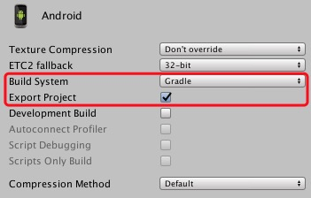

# BCX-Unity-SDK


## 介绍

BCX-Unity-SDK 的实现基于 [BCX-Android-SDK](https://github.com/Cocos-BCX/AndroidSdk) 和 [BCX-iOS-SDK](https://github.com/Cocos-BCX/iOSSDK) , 它针对 Unity 封装了一系列操作 BCX 区块链的接口, 让用户处理登录, 转帐, 交易资产, 调用合约等事宜.

## 工程简介

### 目录简介

* `android` 对 BCX-Android-SDK 作封装, 方便从 Unity 调用其接口
* `ios` 对 BCX-iOS-SDK 作封装, 方便从 Unity 调用其接口
* `unity` BCX-Unity-SDK 工程, 需要导出 BCX-Unity-SDK 也是直接把这个工程导出

### 脚本简介

`tool/genLibAndSync.sh` 为 BCX-Unity-SDK 生成 Android/iOS 侧的库文件，并同步到 BCX-Unity-SDK 工程中.

## BCX-Unity-SDK 工程

以下会介绍 BCX-Unity-SDK 的运行的前提, 如何使用等

## 环境

### Android

1. [Android Studio](https://developer.android.com/studio)

### iOS

1. [CocoaPods](https://cocoapods.org/)
2. Xcode

### Unity

1. [Untiy 2018.1+](https://unity.com/)

## Android/iOS 库文件

运行以下命令, 可以自动生成对应平台的库文件.

```bash
./tool/genLibAndSync.sh
```

## 测试

### Android

1. Unity 中导出 Android 工程, 设置如下:



2. 用 Android Studio 打开导出后的工程
3. 编译, 运行

PS. 在 Android 上编译时, 你可能会遇到 `Error: Cannot fit requested classes in a single dex file (# methods: 149346 > 65536)` 类似的错误, 这是因为Android 对单个 jar 的方法数有限制.

要解决这个问题, 你可以如下修改 build.gradle 文件:

```gradle
...
dependencies {
    ...

    implementation 'com.android.support:multidex:1.0.3' //add
}
...
android {

	defaultConfig {
        ...

		multiDexEnabled true //add
	}
}
...
```

参见URL: https://www.jianshu.com/p/95211b445154

### iOS

1. Unity 中导出 iOS 工程
2. 在导出后的 iOS 工程目录下, 运行 `pod install` (如果没有安装 `CocoaPods` , 需要先安装)
3. 完成后，打开 `Unity-iPhone.xcworkspace`
4. 在 Xcode 中, 修改 `Secp256k1_A` 的配置, 如图:


5. 编译, 运行


## 提示:

1. BCX-Unity-SDK 中的接口很多只接收 id , BCX-Android-SDK 中的接口基本 id, name 都接受, 所以建议在使用中, 尽量传 id . 比如:

```C#
public static void calculate_invoking_contract_fee(string strAccount, string feeAssetSymbol, string contractId, string functionName, string param)
```

feeAssetSymbol 参数在 Android 中传 "COCOS", 或 “1.3.0” 都可以
但是在 iOS 中, 只能传 "1.3.0".


## API

```C#
public static void connect(string chainId, string nodeUrlString, string faucetUrl, string coreAsset, bool isOpenLog)
```

```C#
public static void create_account(string strAccountName, string strPassword, string accountType, bool isAutoLogin)
```

>>
```C#
public static void get_dao_account_objects()
```

>>
```C#
public static void get_accounts(string accountId)
```

>>
```C#
public static void get_full_accounts(string names_or_id, bool subscribe)
```

>>
```C#
public static void lookup_nh_asset(List<string> nh_asset_ids_or_hash)
```

>>
```C#
public static void list_account_nh_asset(string account_id_or_name, List<string> world_view_name_or_ids, int page, int pageSize)
```

>>
```C#
public static void list_account_nh_asset_order(string account_id_or_name, int pageSize, int page)
```

>>
```C#
public static void list_nh_asset_order(string asset_id_or_symbol, string world_view_name_or_ids, string baseDescribe, int pageSize, int page)
```

>>
```C#
public static void lookup_world_view(List<string> world_view_names)
```

>>
```C#
public static void list_nh_asset_by_creator(string account_id, int page, int pageSize)
```

>>
```C#
public static void transfer_nh_asset_fee(string account_from, string account_to, string fee_asset_symbol, string nh_asset_id)
```

>>
```C#
public static void transfer_nh_asset(string password, string account_from, string account_to, string fee_asset_symbol, string nh_asset_id)
```

>>
```C#
public static void delete_nh_asset_fee(string fee_paying_account, string nhasset_id, string fee_symbol)
```

>>
```C#
public static void delete_nh_asset(string fee_paying_account, string password, string nhasset_id, string fee_symbol)
```

>>
```C#
public static void cancel_nh_asset_order_fee(string fee_paying_account, string order_id, string fee_symbol)
```

>>
```C#
public static void cancel_nh_asset_order(string fee_paying_account, string password, string order_id, string fee_symbol)
```

>>
```C#
public static void buy_nh_asset_fee(string fee_paying_account, string order_Id, string fee_paying_asset)
```

>>
```C#
public static void buy_nh_asset(string password, string fee_paying_account, string order_Id, string fee_paying_asset)
```

>>
```C#
public static void create_nh_asset_order_fee(string otcaccount, string seller, string pending_order_nh_asset, string pending_order_fee, string pending_order_fee_symbol, string pending_order_memo, string pending_order_price, string pending_order_price_symbol, long pending_order_valid_time_second)
```

>>
```C#
public static void create_nh_asset_order(string otcaccount, string seller, string password, string pending_order_nh_asset, string pending_order_fee, string pending_order_fee_symbol, string pending_order_memo, string pending_order_price, string pending_order_price_symbol, long pending_order_valid_time_second)
```

>>
```C#
public static void upgrade_to_lifetime_member_fee(string upgrade_account_id_or_symbol, string fee_paying_asset_id_or_symbol)
```

>>
```C#
public static void upgrade_to_lifetime_member(string upgrade_account_id_or_symbol, string upgrade_account_password, string fee_paying_asset_id_or_symbol)
```

>>
```C#
public static void get_contract(string contractNameOrId)
```

>>
```C#
public static void password_login(string strAccountName, string strPassword)
```

>>
```C#
public static void import_keystore(string keystore, string password, string accountType)
```

>>
```C#
public static void export_keystore(string accountName, string password)
```

>>
```C#
public static void import_wif_key(string wifKey, string password, string accountType)
```

>>
```C#
public static void export_private_key(string accountName, string password)
```

>>
```C#
public static void lookup_asset_symbols(string assetsSymbolOrId)
```

>>
```C#
public static void transfer_calculate_fee(string password, string from, string to, string strAmount, string strAssetSymbol, string strFeeSymbolOrId, string strMemo)
```

>>
```C#
public static void calculate_invoking_contract_fee(string strAccount, string feeAssetSymbol, string contractId, string functionName, string param)
```

>>
```C#
public static void invoking_contract(string strAccount, string password, string feeAssetSymbol, string contractNameOrId, string functionName, string param)
```

>>
```C#
public static void transfer(string password, string strFrom, string strTo, string strAmount, string strAssetSymbol, string strFeeSymbol, string strMemo)
```

>>
```C#
public static void get_block(string nBlockNumber)
```

>>
```C#
public static void get_account_history(string accountName, int nLimit)
```

>>
```C#
public static void get_account_balances(string accountId, string assetsId)
```

>>
```C#
public static void get_block_header(double nBlockNumber)
```

>>
```C#
public static void get_dynamic_global_properties()
```

>>
```C#
public static void get_transaction_in_block_info(string tr_id)
```

>>
```C#
public static void get_transaction_by_id(string tr_id)
```

>>
```C#
public static void decrypt_memo_message(string accountName, string password, string mMemoJson)
```

>>取 BCX-Unity-SDK 的版本信息

>>版本结构为 {BCX-Unity-SDK-Version}-{BCX-iOS-SDK-Version/BCX-Android-SDK-Version}
```C#
public static void get_version_info()
```

>>
```C#
public static void log_out(string accountName)
```


未来可用用测试的 trid

3e676dd898f4b50c99b59febab4f424d57776ffbf9af9966957f0da546d2841b

"hugoo" : "1.2.72961"
contract_id" : "1.16.42"


